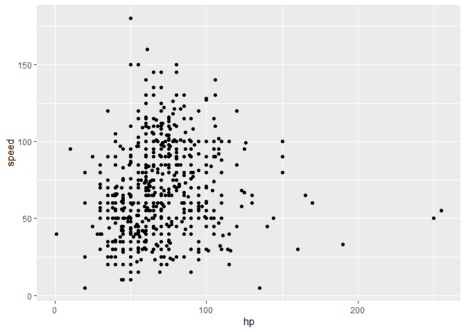

stats learning
================
Shun Xie
2022-12-01

``` r
library(tidyverse)
```

    ## ── Attaching packages ─────────────────────────────────────── tidyverse 1.3.2 ──
    ## ✔ ggplot2 3.3.6      ✔ purrr   0.3.4 
    ## ✔ tibble  3.1.8      ✔ dplyr   1.0.10
    ## ✔ tidyr   1.2.0      ✔ stringr 1.4.1 
    ## ✔ readr   2.1.2      ✔ forcats 0.5.2 
    ## ── Conflicts ────────────────────────────────────────── tidyverse_conflicts() ──
    ## ✖ dplyr::filter() masks stats::filter()
    ## ✖ dplyr::lag()    masks stats::lag()

``` r
library(glmnet)
```

    ## Loading required package: Matrix

    ## Warning: package 'Matrix' was built under R version 4.2.2

    ## 
    ## Attaching package: 'Matrix'
    ## 
    ## The following objects are masked from 'package:tidyr':
    ## 
    ##     expand, pack, unpack
    ## 
    ## Loaded glmnet 4.1-4

``` r
set.seed(11)
```

``` r
bwt_df = 
  read_csv("./data/birthweight.csv") %>% 
  janitor::clean_names() %>%
  mutate(
    babysex = as.factor(babysex),
    babysex = fct_recode(babysex, "male" = "1", "female" = "2"),
    frace = as.factor(frace),
    frace = fct_recode(frace, "white" = "1", "black" = "2", "asian" = "3", 
                       "puerto rican" = "4", "other" = "8"),
    malform = as.logical(malform),
    mrace = as.factor(mrace),
    mrace = fct_recode(mrace, "white" = "1", "black" = "2", "asian" = "3", 
                       "puerto rican" = "4")) %>% 
  sample_n(200)
```

    ## Rows: 4342 Columns: 20
    ## ── Column specification ────────────────────────────────────────────────────────
    ## Delimiter: ","
    ## dbl (20): babysex, bhead, blength, bwt, delwt, fincome, frace, gaweeks, malf...
    ## 
    ## ℹ Use `spec()` to retrieve the full column specification for this data.
    ## ℹ Specify the column types or set `show_col_types = FALSE` to quiet this message.

``` r
#ignore the interception column, get the matrix
x = model.matrix(bwt ~ ., bwt_df)[,-1]
y = bwt_df$bwt
```

``` r
#set lambda
lambda = 10^(seq(3, -2, -0.1))

#x design matrix, y vector
lasso_fit =
  glmnet(x, y, lambda = lambda)

lasso_cv =
  cv.glmnet(x, y, lambda = lambda)

lambda_opt = lasso_cv$lambda.min
```

``` r
broom::tidy(lasso_fit) %>% 
  select(term, lambda, estimate) %>% 
  complete(term, lambda, fill = list(estimate = 0) ) %>% 
  filter(term != "(Intercept)") %>% 
  ggplot(aes(x = log(lambda, 10), y = estimate, group = term, color = term)) + 
  geom_path() + 
  geom_vline(xintercept = log(lambda_opt, 10), color = "blue", size = 1.2) +
  theme(legend.position = "none")
```

<!-- -->

# Clustering

``` r
poke_df = 
  read_csv("./data/pokemon.csv") %>% 
  janitor::clean_names() %>% 
  select(hp, speed)
```

    ## Rows: 800 Columns: 13
    ## ── Column specification ────────────────────────────────────────────────────────
    ## Delimiter: ","
    ## chr (3): Name, Type 1, Type 2
    ## dbl (9): #, Total, HP, Attack, Defense, Sp. Atk, Sp. Def, Speed, Generation
    ## lgl (1): Legendary
    ## 
    ## ℹ Use `spec()` to retrieve the full column specification for this data.
    ## ℹ Specify the column types or set `show_col_types = FALSE` to quiet this message.

``` r
poke_df %>% 
  ggplot(aes(x = hp, y = speed)) + 
  geom_point()
```

<!-- -->

``` r
kmeans_fit =
  kmeans(x = poke_df, centers = 3)

poke_df =
  broom::augment(kmeans_fit, poke_df)

poke_df %>% 
  ggplot(aes(x = hp, y = speed, color = .cluster)) +
  geom_point()
```

<!-- -->

### Trajactory
